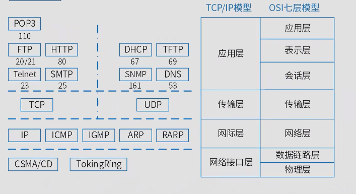
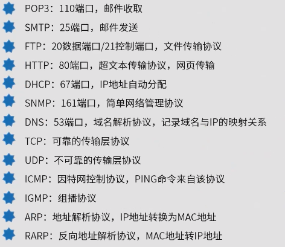

## 计算机网络(总的在上午考试,占比很少,4分左右)

[TOC]

### TCP/IP协议 ⭐⭐⭐

古老的OSI(Open System Interconnection)7层网络协议模型已经淡出计算机网络世界,如今绝大多数网络协议都是TCP/IP协议4层模型.

OSI协议7层模型:

- 应用层
- 表示层
- 会话层
- 传输层
- 网络层
- 数据链路层
- 物理层

TCP/IP协议4层模型:

- 应用层: FTP, HTTP, Telnet, SSH, SMTP, DHCP, TFTP, SNMP, DNS 
- 传输层: TCP, UDP
- 网络层: IP, ICMP, IGMP, ARP, RARP
- 网络接口层: CSMA/CD, TokingRing

#### TCP与UDP

TCP与UDP协议的区别与不同老生常谈了,很多面试都会面到.

相同点:

- 都是传输层协议
- 可根据端口寻址

不同点:

| TCP                             | IP             |
| ------------------------------- | -------------- |
| 要有连接                        | 无连接         |
| 三次握手                        | 无连接         |
| 流量控制                        | 无流量控制     |
| 差错校验和重传                  | 错误检测性弱   |
| IP数据报按序接受(不丢失\不重传) | 无拥塞控制     |
| 可靠性强                        | 不可靠         |
| 牺牲通信率                      | 传输高速       |
| 效率低                          | 不负责建立连接 |

相关协议:

| TCP                              | IP                       |
| -------------------------------- | ------------------------ |
| HTTP\ FTP \ Telnet \ POP3 \ SMTP | DNS \ DHCP \ TFTP \ SNMP |

#### DHCP与DNS

#### DNS(Domain Name System)域名解析协议.

IP寻址方式:

- 递归查询: 服务器必须回答目标IP与域名的映射关系(就是主机跟域名服务器的寻址)
- 迭代查询: 服务区收到一次迭代查询回复一次结果,可能不是目标IP与域名的映射,也可以是其他DNS服务器的地址(一般存在域名服务器之间)

解析方式:

- 主机向本地域名服务器的查询采用递归查询
- 本地域名服务器向根域名服务器的查询通常采用迭代查询

#### DHCP(Dynamic Host Configuration Protocol)动态主机配置协议.

在访问网络(局域网或者外网)时动态的分配主机的IP地址,即一般的网络配置中的自动获取IP地址的协议.

- C/S结构

- 分配方式:

  固定分配 (网络管理员静态绑定主机IP地址)

  自动分配 (服务器网关为主机分配租期无限长的IP地址)

  动态分配 (服务器网关为主机分配一定有效租期的IP地址)

- 租约默认8天
- 租约过半,主机需要向DHCP服务器申请续租
- 租约87.5%,如果DHCP服务器没有响应分配,找其他的DHCP服务器
- 无效地址: 169.254.X.X(windows下,微软保留地址) 和 0.0.0.0(linux下)

### 网络规划与设计⭐⭐⭐⭐

网络规划与设计流程:

- 需求分析: 确定网络使用的业务需求\用户需求\应用需求\计算机平台需求\网络通信需求等,产生需求规范
- 通信规范分析: 现有的网络体系评估,测量通信量和设备利用率等,产生通信规范
- 逻辑网络设计: 确定网络逻辑结构以符合需求,产生逻辑设计文档
- 物理网络设计: 将逻辑设计应用到物理网络结构,产生物理结构设计文档
- 实施阶段: 买网络设备部署\安装\维护

#### 逻辑设计与物理设计

#### 逻辑网络设计: 

通过需求规范和通信规范,设计适宜的网络逻辑结构,利用需求分析和现有网络体系分析结果进行设计,并基于该结构实施后续的资源分配规划\安全规划等.

逻辑网络设计工作主要内容:

- 网络结构的设计
- 物理层技术的选择
- 局域网技术的选择与应用
- 广域网技术的选择与应用
- 地址设计和模型命名
- 路由选择协议
- 网络管理
- 网络安全
- 逻辑网络设计文档

逻辑网络设计的主要产出:

- 逻辑网络设计图
- IP地址方案
- 安全管理方案
- 具体的软/硬件,广域网的连接设备和基本的网络服务
- 招聘\培训网络员工的具体说明
- 对软\硬件费用,服务提供费用,员工和培训费用的初步估计

#### 物理网络设计:

对逻辑网络设计的物理实现,通过对设备的分布\排线\运行环境等的确定,确保物理连接符合逻辑连接的需求.

物理网络设计的主要产出:

- 网络物理结构图和布线方案
- 设备和部件的详细列表清单
- 软硬件和安装费用的估算
- 日程安排,详细说明服务的部署安装维护时间及期限
- 安装后的测试计划
- 用户的培训计划

#### 层次化网络结构设计

主要层次可分为3层:

- 核心层: 负责数据的高速传输,实现出口路由,常用冗余机制(即使出错也能快速切换)
- 汇聚层: 网络访问策略控制,数据包过滤处理,策略路由,广播域定义寻址等
- 接入层: 用户接入,计费管理, MAC地址认证,MAC地址过滤,收集用户信息,可以使用集线器代替交换机

#### 网络冗余设计

网络冗余设计常见的主要目标有两个: 备用路径和负载分担

备用路径: 提高可用性,由路由器\交换机等设备之间的独立备用链路构成,一般情况下仅在主要路径失效时投入使用,设计时需要考虑:

- 备用路径的带宽
- 切换时间
- 非对称
- 自动切换
- 测试

负载分担: 是对备用路径的扩充,通过并行的链路提供流量分流来提高性能,主要实现方式是通过多个网络接口和路径来同时传递流浪,设计时需要考虑:

- 网络中存在备用路径链路时,可以考虑加入负载分担设计
- 对于主路径和备用路径相同的情况,可以实施负载分担的特例-负载均衡
- 对于主路径和备用路径不相同的情况,可以采用策略;路由机制,让一部分流量分摊到备用路径上

### 网络存储⭐⭐

#### 网络存储分类:

- 直连式存储(DAS, Direct Attached Storage),也可称SAS(Server Attached Storage,服务器附加存储)
  - 通过SCSI连接到服务器,就是在服务器上加存储设备,不带OS,不能跨平台共享
- 网络附加存储(NAS, NetWork Area Storage)
  - 通过网络接口与协议由网络直接连接,由用户据通过网络访问(支持多种TCP/IP协议),有自己的OS,相当于一个文件服务器,存储信息采用RAID(Redundant Array of Independent Disks, 独立磁盘冗余阵列)进行管理,即插即用
- 存储区网络(SAN, san值狂掉??, Storage Area NetWork),如IPSAN(ISCSI)
  - 通过专用的高速网络将多个网络存储设备和服务器连接起来的专用存储系统,采用数据块的方式进行数据和信息的存储,目前主要使用以太网(IP-SAN)和光纤通道(FC-SAN)两类环境
  - IP-SAN: 基于IP网络实现,设备成本低,配置技术简单,可共享和使用大容量的存储空间

#### RAID分类:

- RAID0(条块化): 性能最高,并行处理,无冗余,损坏无法修复
- RAID1(镜像结构): 用一半空一半,一半坏了用另一半,可修复性好
- RAID0+1(RAID10): RAID0和RAID1的结合,高效可靠,企业一般采用这种方式较多
- RAID3(奇偶校验并行传送): 有效容量N - 1 / N, 有固定的校验盘,坏一个盘可修复
- RAID5(分布式奇偶校验的独立磁盘): 有效容量N - 1 / N,无固定的校验盘,坏一个盘可以修复,具备容错功能
- RAID6(两种存储的奇偶校验): 有效容量 N - 2 / N,无固定校验盘,坏两个盘可以修复

### IPv6⭐

IPv6设计用来代替IPv4的下一代协议,就是地址不够了,IPv4是32位,大概40亿,IPv6有128位,自己算去吧.其特点如下:

- 寻址能力扩展. 32位 -> 128位
- IP报文头部格式灵活: 固定格式的扩展头部取代IPv4中的可变长度的选项字段,加快了报文处理速度,如果固定格式能否被称作灵活??(I Have Question)
- 简化了报文头部格式: 字段只有8个,加快报文转发,提高了吞吐量
- 提高安全性: 身份认证和隐私权
- 支持更多服务类型
- 允许协议继续演变,增加新功能,适应未来技术的发展??(128位不得不服)

示例:

IPv6由8个16进制字段构成:

2001:0db8:85ad:0000:1314:8888:0258:1234

等价于:

2001:0db8:85ad::1314:8888:0258:1234

中间有很多0字段也可写作:

2001:0db8:0000:0000:0000:8888:0258:1234

2001:0db8:0:0:0:8888:0258:1234

2001:0db8::8888:0258:1234

2001:db8::8888:258:1234

前导0可以省略

注意不能:

2001:0db8::::8888:0258:1234

#### 常用IPv地址分类:

- 单播地址(Unicast):  用于单个接口的标识符,传统的点对点通信
  - 可聚合全球单播地址: 前缀001
  - 本地单播地址: 
    - 链路本地: 前缀为 1111111010(一般fe80开头)
    - 站点本地: 前缀为 1111111011
- 组播地址(Muticast): 多播地址,一点对多点的通信,数据包交付到一组计算机种的每一个, IPv6没有广播的概念,将广播看作多播的特例,前缀为 11111111
- 任播地址(Anycast): 泛播地址,是IPv6增加的类型,目的站是一组计算机,但数据包只交付给其中一个,通常是最近的一个, 前缀固定,其余位置为0

IPv6规定每个网卡最少有3个IPv6地址,分别是:

- 链路本地地址
- 全球单播地址
- 回送地址(站点本地地址)

IPv6把自动IP地址配置作为标准功能,只要连接网络便会自动分配IP,其配置可分为:

-  全状态自动配置(Stateful Auto-Configuration): 继承了IPv4动态主机配置协议(DHCP)服务
- 无状态自动配置(Stateless Auto-Configuration): 主机通过两个阶段分别获得链路本地地址和可聚合全球单播地址
  - 首先主句将网卡MAC地址附加再链路本地地址前缀1111 1110 10之后, 产生一个链路本地地址,发出一个ICMPv6邻居发现请求,验证地址的唯一性,不唯一则使用随机接口ID组成新的
  - 以链路本地地址为源地址,向本地链路中所有路由器的ICMPv6路由器请求报文并返回一个包含可聚合全球单播地址前缀的路由器公告报文响应.源地址加上自己的接口ID,自动配置一个全球单播地址,使用无状态自动配置,无须手动干预即可改变主机的IPv6地址

#### IPv4/IPv6的过渡协议

- 双协议栈技术: 双栈技术通过节点对IPv4和IPv6双协议栈的支持,从而支持两种业务的共存
- 隧道技术: 在IPv4中部署隧道,实现在IPv4上对IPv6的业务承载,保证业务的共存和过渡,隧道技术包括: 6to4隧道,6over4隧道,ISATAP隧道
- NAT-PT技术: NAT-PT使用网关设备连接IPv4和IPv6网络,当IPv4和IPv6互相访问时,由NAT-PT网关实现两种协议的转换翻译和地址的映射

### 网络接入

#### 有线接入

- 公用交换电话网络(PSTN)
- 数字数据网(DDN)
- 综合业务数字网(ISDN)
- 非对称数字用户线路(ADSL)
- 同轴光纤技术(HFC)

#### 无线接入

- IEEE 802.11(WiFi)
- IEEE 802.15(蓝牙)
- 红外(IrDA)
- WAPI

### 综合布线⭐

| 综合布线系统   | 描述                                                         |
| -------------- | ------------------------------------------------------------ |
| 工作区子系统   | 由信息插座\插座盒\连续跳线和设配器做成                       |
| 水平子系统     | 水平布置到管理间的配线架的线缆组成                           |
| 管理子系统     | 由交连\互连配线架组成,为连接其他子系统提供连接手段           |
| 垂直干线子系统 | 建筑物所有垂直干线电缆和支撑组成,以提供设备间总配线架与各干线楼层配线架之间的干线路由 |
| 设备间子系统   | 由设备间种的电缆\连接器\支撑组成,将计算机\PBX\摄像头\监视器等弱电设备互连起来并连接到主配线架上 |
| 建筑群子系统   | 楼与楼之间的通信设备和装置,常用介质光缆                      |

### 网络技术扩展

#### 物联网

实现物物相连的互联网络,内涵包括:

- 基于互联网的延伸与扩展
- 用户端扩展到任何物体与物体之间,进行信息交换与通信

分层:

- 感知层: 识别物体\采集信息,如: 二维码\RFID(Radio Frequenry Identification, 无线射频识别技术)\摄像头\传感器
- 网络层: 传递信息和处理信息,通信网与互联网的融合网络\网络管理中心\信息中心\智能处理中心
- 应用层: 解决信息处理和人机交互的问题

#### RFID

又称电子标签,通过无线电讯号识别特定目标并读写相关数据,无需识别系统与特定目标建立机械或光学接触,物联网核心技术,基本组成通常包括: 标签\阅读器\天线

#### 二维码

使用若干与二进制对应的几何形体来表示文字数值信息,通过图像输入设备或光电扫描设备自动识读以实现信息自动处理,常见码制有:

- Data Matrix
- Maxi Code
- Aztec
- QR Code
- Vericode
- PDF417
- Ultracode
- Code 49
- Code 16K

若采用扩展的字母数字压缩格式,可容纳1850个字符

若采用二进制/ASCII格式, 可容纳1108个字节

若采用数字压缩格式,可容纳2710个数字

#### 云计算

云计算是一种基于互联网的计算方式,共享的软硬件资源和信息可以按需提供给计算机和其他设备,核心思想是将大量用网络连接的计算资源统一管理和调度,构成一个计算机源为用户按需服务.狭义云计算指IT基础设施的交付和使用模式,通过网络以按需\易扩展的方式获得所需资源;广义云计算是获得所需服务.特点如下:

- 集合了大量计算机,规模达到成千上万
- 多种软硬件技术相结合
- 对客户端设备的要求低
- 规模化效应

软件即服务(SaaS)

平台即服务(PaaS)

基础设施即服务(IaaS)