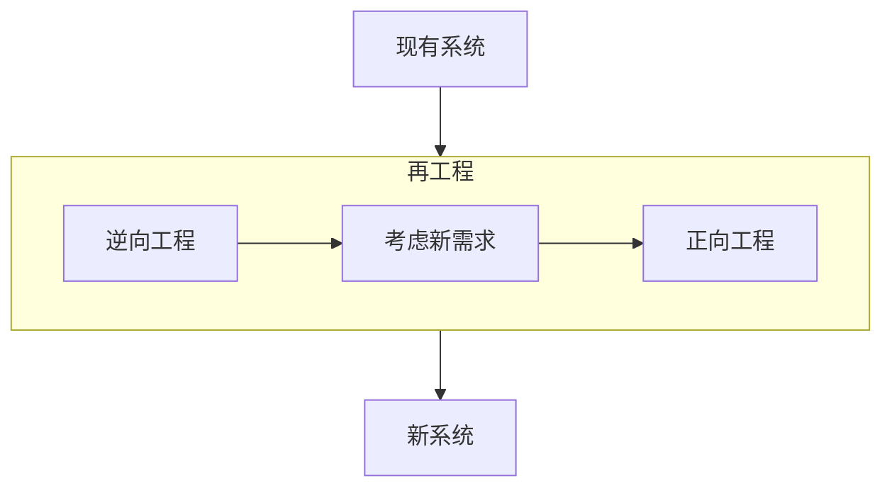
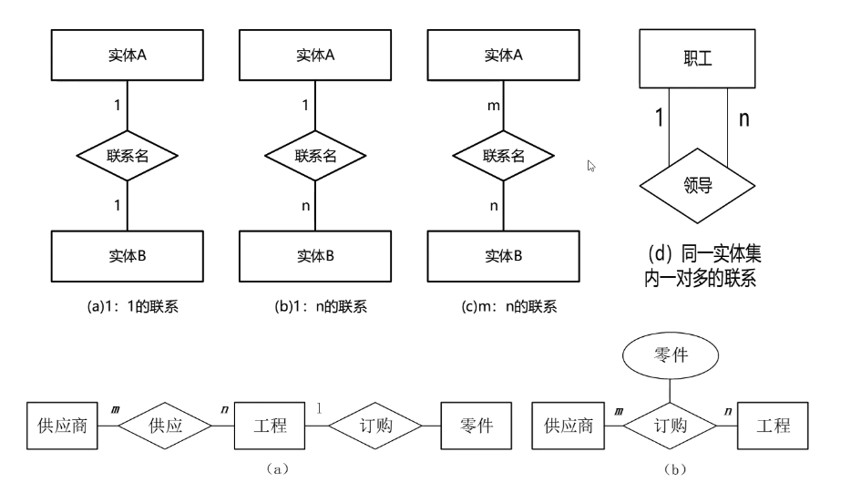

# 软件工程⭐⭐⭐⭐⭐

## 软件开发方法

### 结构化方法

自顶向下，逐步分解求精。严格分阶段，阶段产出标准化，应变能力差

### 面向对象

自底向上，阶段界限不明，更好应变、更好服用、符合人们的思维习惯

### 面向服务

粗粒度、松耦合、标准化和构建话。

抽象级别：操作-->服务--->业务流程

### 原型法（需求阶段）

针对需求不明确

按功能分：水平原型（界面， 例如：墨客等一些画原型界面的软件）、垂直原型（复杂算法  例如：抖音推荐算法）

按最终结果分：

- 抛弃式原型

  利用原型了解用户的所思所想后，抛弃原型，进行开发

- 演化式原型。

  根据原型逐步演化成最终的开发方案

### 形式化方法

*数学模型*，建立在**严格数学**基础上的软件开发方法

所有东西均可证明/验证，而不是测试

### 统一过程方法UP

### 敏捷方法

### 基于架构的开发方法ABSD

## 软件开发模型

### 瀑布模型 SDLC

典型的结构化开发方法模型

定义阶段、开发阶段、维护阶段。

最大特点就是分阶段，每一阶段都有产出。

不适用场景：需求不明确

### 增量模型与螺旋模型

复合模型，以原型为基础+瀑布模型，同时引入了**风险分析**

### V模型

测试驱动，测试贯穿始终

需求分析、概要设计、详细设计、编码、单元测试、集成测试、系统测试、验收测试

### 喷泉模型

特点：迭代、无间隙

早期著名的面向对象模型

### 构建组装模型 CBSD

特点：速度快、成本低、稳定性高（ bug错误等早期会被发现，越后期越复用越可靠 ）

需求分析和定义、软件架构设计、构件库的建立、应用软件构建、测试和发布

### 快速应用开发模型 RAD

复合模型，瀑布模型SDLC+构建组装模型CBSD。 例如各种低代码平台

业务建模、数据建模、过程建模、应用生成、测试和交付

### 统一过程 UP

核心特点：

- 用例驱动
- 以构建为中心
- 迭代和增量。每一轮迭代都要进行测试与集成。

四个阶段：

- 初始:  定义最终产品视图和业务模型、确定系统范围
- 细化:  **设计及确定系统架构**、制定工作计划和资源要求
- 构建：构造产品并继续演进需求
- 交付：交付给用户

### 敏捷方法

特点：

- 适应性

  传统方法是预设性的，每一个开发阶段都是规定好的，而敏捷方法是适应性的，需求是不明确的

- 以人为本

  给程序员减负，不规定各种文档和要求，以能写出代码为目的。传统方法是以开发过程为本。

- 增量迭代、小步快跑

- 适合小型项目

四大价值观：

- 沟通

  因为文档已经被废除，所以使用面对面沟通替代

- 简单

  代码不进行过度设计

- 反馈

  及时反馈，更快地和用户对接

- 勇气

  接受需求变更的勇气

12条过程实践规则（ 论文可选用 ）：

- 简单设计
- 测试驱动
- 代码重构
- 结对编程
- 持续集成
- 现场客户
- 发行版本小型化
- 系统隐喻
- 代码集体所有制
- 规划策略
- 规划代码
- 40小时工作制

其他的敏捷开发方法下的模型：

- 极限编程 XP： 对一些**费用控制严格**的场景有效
- 水晶方法：用**最少纪律约束**而任然能成功的方法
- 开放式源码：开发人员**地域分布很广**（ 可以不在同一地方工作 ）
- SCRUM:  明确定义了可重复的方法（ 将大项目分解成各个小项目，周期性的小项目冲刺 ）
- 功用驱动开发方法 FDD：首席程序员和“类”程序员
- ASD方法：核心是三个非线性、重叠的开发阶段：**猜测、合作和学习**

## 逆向工程

逆向工程是设计的恢复过程， 分析已有程序，寻求比源代码更高级、更抽象的表现形式，具体分如下四个抽象层级：

- 实现级：程序的**抽象语法树、符号表、过程**的设计表示
- 结构级：反映**程序分量之间互相依赖关系**的信息，如：调用图、结构图、程序、数据结构
- 功能级：反映**程序段功能及程序段之间关系**的信息。如：数据和控制流模型
- 领域级：反映程序分量或**程序实体与应用领域概念之间**的对应关系的信息。如：实体关系信息

## 需求工程⭐⭐⭐⭐

### 概念

软件需求是指**用户对系统**在功能、行为、性能、设计约束等方面的**期望**

两个专有名词解释, 什么叫*需求开发*，什么叫*需求管理*?：

- **需求开发**（技术维度）
  - 需求获取  （ 收集用户的想法 ）
  - 需求分析
  - 需求定义  （ 形成SRS需求规格说明书 ）
  - 需求验证  （ 邀各方人员签字评审， 落地成**需求基线** ）
- **需求管理**（管理维度）
  - 变更控制  （ 和需求基线不一致，申请变更需求 ）
  - 版本控制  （ 将需求变化用系统管控起来 ）
  - 需求跟踪  （ 跟进落实需求 ）
  - 需求状态跟踪

### 需求开发 / 需求获取

需求获取获取方法:

- 收集资料
- 联合讨论会
- 用户访谈
- 书面调查
- 现场观摩
- 参加业务实践
- 阅读历史文档
- 抽样调查

需求分类：

- 业务需求（整体全局）

  愿景，整体的需求，业务目标，可以说是老板视角

- 用户需求 （用户视角）

- 系统需求 （ 计算机化）

  - 功能需求
  - 性能需求 （ 比如说客户要求5G内模型能流畅查看 ）
  - 设计约束 （ 比如说客户要求使用Java语言、要求使用指定数据库、要求自主研发等 ）

管理维度上的需求分类：

- 基本需求（ 明示， 常规需求 ）
- 期望需求（ 隐含 。客户觉得理所应当的需求， 没有明确表达的需求）
- 兴奋需求 （ 多余。 不该做的，做出后超出客户期望的需求）

### 需求开发/需求分析/结构化分析方法 SA

#### 功能模型

数据流图（DFD）用于对**功能建模**。

数据流图四大构成要素：

- 数据流 （ 图中箭头部分，表示数据的流向 ）
- 加工 （ 描述了输入数据流到输出数据流的转变，也就是下图中圆圈的处理 ）
- 数据存储 （ 表示暂时存储的数据 ）
- 外部实体 （ 存在于软件系统外的人员 ）

#### 行为模型

状态转换图（STD）

- 状态（初态、终态）
- 事件

#### 数据模型

ER图，**实体 & 联系**

