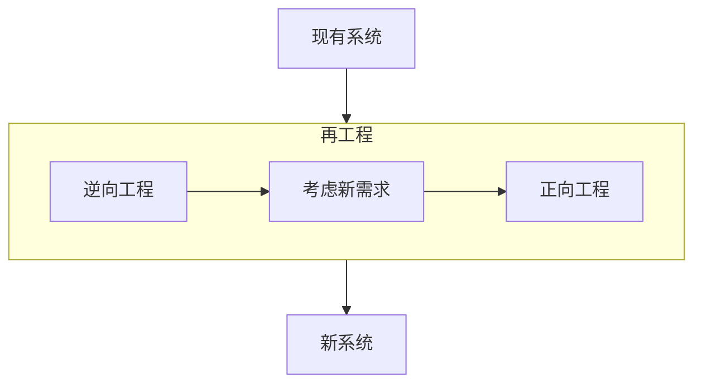
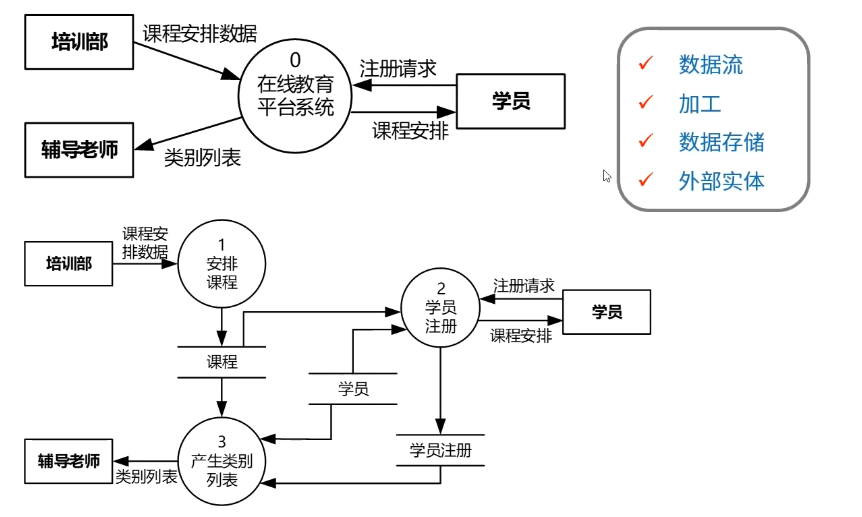
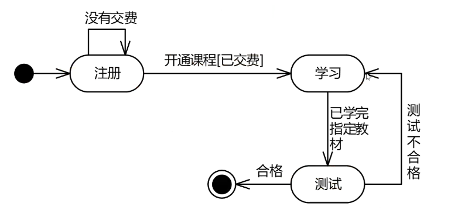

# 软件工程⭐⭐⭐⭐⭐

[TOC]

## 软件开发方法

### 结构化方法

自顶向下，逐步分解求精。严格分阶段，阶段产出标准化，应变能力差

### 面向对象

自底向上，阶段界限不明，更好应变、更好服用、符合人们的思维习惯

### 面向服务

粗粒度、松耦合、标准化和构建话。

抽象级别：操作-->服务--->业务流程

### 原型法（需求阶段）

针对需求不明确

按功能分：水平原型（界面， 例如：墨客等一些画原型界面的软件）、垂直原型（复杂算法  例如：抖音推荐算法）

按最终结果分：

- 抛弃式原型

  利用原型了解用户的所思所想后，抛弃原型，进行开发

- 演化式原型。

  根据原型逐步演化成最终的开发方案

### 形式化方法

*数学模型*，建立在**严格数学**基础上的软件开发方法

所有东西均可证明/验证，而不是测试

### 统一过程方法UP

### 敏捷方法

### 基于架构的开发方法ABSD

## 软件开发模型

### 瀑布模型 SDLC

典型的结构化开发方法模型

定义阶段、开发阶段、维护阶段。

最大特点就是分阶段，每一阶段都有产出。

不适用场景：需求不明确

### 增量模型与螺旋模型

复合模型，以原型为基础+瀑布模型，同时引入了**风险分析**

### V模型

测试驱动，测试贯穿始终

需求分析、概要设计、详细设计、编码、单元测试、集成测试、系统测试、验收测试

### 喷泉模型

特点：迭代、无间隙

早期著名的面向对象模型

### 构建组装模型 CBSD

特点：速度快、成本低、稳定性高（ bug错误等早期会被发现，越后期越复用越可靠 ）

需求分析和定义、软件架构设计、构件库的建立、应用软件构建、测试和发布

### 快速应用开发模型 RAD

复合模型，瀑布模型SDLC+构建组装模型CBSD。 例如各种低代码平台

业务建模、数据建模、过程建模、应用生成、测试和交付

### 统一过程 UP

核心特点：

- 用例驱动
- 以构建为中心
- 迭代和增量。每一轮迭代都要进行测试与集成。

四个阶段：

- 初始:  定义最终产品视图和业务模型、确定系统范围
- 细化:  **设计及确定系统架构**、制定工作计划和资源要求
- 构建：构造产品并继续演进需求
- 交付：交付给用户

### 敏捷方法

特点：

- 适应性

  传统方法是预设性的，每一个开发阶段都是规定好的，而敏捷方法是适应性的，需求是不明确的

- 以人为本

  给程序员减负，不规定各种文档和要求，以能写出代码为目的。传统方法是以开发过程为本。

- 增量迭代、小步快跑

- 适合小型项目

四大价值观：

- 沟通

  因为文档已经被废除，所以使用面对面沟通替代

- 简单

  代码不进行过度设计

- 反馈

  及时反馈，更快地和用户对接

- 勇气

  接受需求变更的勇气

12条过程实践规则（ 论文可选用 ）：

- 简单设计
- 测试驱动
- 代码重构
- 结对编程
- 持续集成
- 现场客户
- 发行版本小型化
- 系统隐喻
- 代码集体所有制
- 规划策略
- 规划代码
- 40小时工作制

其他的敏捷开发方法下的模型：

- 极限编程 XP： 对一些**费用控制严格**的场景有效
- 水晶方法：用**最少纪律约束**而任然能成功的方法
- 开放式源码：开发人员**地域分布很广**（ 可以不在同一地方工作 ）
- SCRUM:  明确定义了可重复的方法（ 将大项目分解成各个小项目，周期性的小项目冲刺 ）
- 功用驱动开发方法 FDD：首席程序员和“类”程序员
- ASD方法：核心是三个非线性、重叠的开发阶段：**猜测、合作和学习**

## 逆向工程

逆向工程是设计的恢复过程， 分析已有程序，寻求比源代码更高级、更抽象的表现形式，具体分如下四个抽象层级：

- 实现级：程序的**抽象语法树、符号表、过程**的设计表示
- 结构级：反映**程序分量之间互相依赖关系**的信息，如：调用图、结构图、程序、数据结构
- 功能级：反映**程序段功能及程序段之间关系**的信息。如：数据和控制流模型
- 领域级：反映程序分量或**程序实体与应用领域概念之间**的对应关系的信息。如：实体关系信息

## 需求工程⭐⭐⭐⭐

### 概念

软件需求是指**用户对系统**在功能、行为、性能、设计约束等方面的**期望**

两个专有名词解释, 什么叫*需求开发*，什么叫*需求管理*?：

- **需求开发**（技术维度）
  - 需求获取  （ 收集用户的想法 ）
  - 需求分析
  - 需求定义  （ 形成SRS需求规格说明书 ）
  - 需求验证  （ 邀各方人员签字评审， 落地成**需求基线** ）
- **需求管理**（管理维度）
  - 变更控制  （ 和需求基线不一致，申请变更需求 ）
  - 版本控制  （ 将需求变化用系统管控起来 ）
  - 需求跟踪  （ 跟进落实需求 ）
  - 需求状态跟踪

### 需求开发 / 需求获取

需求获取获取方法:

- 收集资料
- 联合讨论会
- 用户访谈
- 书面调查
- 现场观摩
- 参加业务实践
- 阅读历史文档
- 抽样调查

需求分类：

- 业务需求（整体全局）

  愿景，整体的需求，业务目标，可以说是老板视角

- 用户需求 （用户视角）

- 系统需求 （ 计算机化）

  - 功能需求
  - 性能需求 （ 比如说客户要求5G内模型能流畅查看 ）
  - 设计约束 （ 比如说客户要求使用Java语言、要求使用指定数据库、要求自主研发等 ）

管理维度上的需求分类：

- 基本需求（ 明示， 常规需求 ）
- 期望需求（ 隐含 。客户觉得理所应当的需求， 没有明确表达的需求）
- 兴奋需求 （ 多余。 不该做的，做出后超出客户期望的需求）

### 需求开发/需求分析/结构化分析方法 SA

#### 功能模型

数据流图（DFD）用于对**功能建模**。

数据流图四大构成要素：

- 数据流 （ 图中箭头部分，表示数据的流向 ）
- 加工 （ 描述了输入数据流到输出数据流的转变，也就是下图中圆圈的处理 ）
- 数据存储 （ 表示暂时存储的数据 ）
- 外部实体 （ 存在于软件系统外的人员 ）

#### 行为模型

状态转换图（STD）

- 状态（初态、终态）
- 事件

#### 数据模型

ER图，**实体 & 联系**

### 需求开发/需求分析/面向对象分析方法 OOA

#### UML统一建模语言基本结构

基本结构

- 构造块
- 规则
- 公共（通用）机制

#### UML构造块/事物

构造块分为事物、关系、图:

- 事物 

  事物包含四种分类

  - 结构事物： 最静态的部分 （ 类、接口、构件、节点 ）
  - 行为事物：代表时间和空间上的动作 （ 消息、动作次序、连接 ）
  - 分组事物：看成是个盒子（ 包、构件 ）
  - 注释事物：UML的解释部分

#### UML构造块/关系

- 关系

  关系分为六种

  - 泛化关系 ( 就是继承关系，一个类继承另一个类的功能，并可以额外增加自己的功能 )
  - 实现关系（ 指一个类实现interface接口的功能 ）
  - 依赖关系 （ 类与类之间的联接，一个类依赖于另一个类的定义 ）
  - 关联关系 （ 它使一个类知道另一个类的属性和方法（实例变量体现） ）
    - 一对一
    - 一对多
    - 多对一
    - 多对多
    - 单向
    - 双向
  - 聚合关系（ 体现的是整体和部分的关系 ）
  - 组合关系 （ 体现的是一种包含关系，比聚合更强，或称为强聚合 ）

#### UML构造块/图

图分为**静态图**和**动态图**（行为图）

静态图:

- 类图
- 对象图
- 构件图
- **部署图** ( 软硬件之间的映射 )
- 制品图
- 包图
- 组合结构图

动态图：（看到图要能知道对应的是什么名称，以下给出网络图像）

- **用例图**:  系统与外部参与者的交互

  

- **顺序图**: 强调按时间顺序

  

- **通信图**（协作图）

  

- **状态图：状态转换变迁**

  

- **活动图:  类似程序流程图，并行行为**

  

  - **定时图（时序图）：强调实际时间**

    

- **交互概览图**

  

#### UML构造块/UML4+1视图

上面列举了多个UML图，可以将其分成类。4+1视图是对逻辑架构进行描述的，最早由Philippe Kruchten提出，现在已经成为架构设计的结构标准。

每一个视图只关心系统的一个侧面，五个视图结合在一起才能反映系统的软件体系架构的全部内容。

>  视图名中的括号表示也可以叫括号中的名字。

| 视图名           | 内容                             | 主要关心参与人员   | 举例                   |
| ---------------- | -------------------------------- | ------------------ | ---------------------- |
| 逻辑视图         | 设计的**对象模型、关注功能**设计 | 系统分析、设计人员 | 用例图、交互图、时序图 |
| 开发（实现）视图 | 开发环境中软件的静态组织结构     | 程序员、项目经理   | 组件图、包图           |
| 进程视图         | 捕捉设计的**并发**和同步特征     | 系统集成人员       | 活动图                 |
| 物理（部署）视图 | **软件到硬件**的映射             | 系统和网络工程师   | 部署图                 |
| 场景（用例）视图 | 有机联系上面四个视图             | 最终用户           | 用例图、活动图         |

#### 用例模型（TODO）

上面全是UML的基础概念，现在是OOA需求分析的正式阶段，面向对象需求分析通常会建立两种模型：用例模型和分析模型。

#### 分析模型（TODO）

### 需求开发/需求定义

#### 严格定义法

- **所有需求都能被预先定义**
- 开发人员与用户之间能够准确而清晰地交流
- 采用图形/文字可以充分体现最终系统

#### 原型法

- **并非所有的需求都能在开发前被准确的说明**
- 项目参与者之间通常存在交流困难
- 需要实际的、可供用户参与的系统模型
- 有合适的系统开发环境
- 反复是完全需要和值得提倡的、需求一旦确定，就应该遵从严格的方法

### 需求开发/需求验证

- 需求评审
- 需求测试

### 需求管理

#### 定义需求基线

#### 需求跟踪

#### 需求变更管理过程

识别出需求问题后，将会经历以下几个过程：

- 问题分析和变更描述
- **变更分析和成本计算**
- （经过CCB需求变更委员会讨论后）变更实现

## 系统设计

### 界面设计

黄金三法则

- 置于用户控制之下
- 减少用户记忆负担
- 保持界面的一致性

### 软件设计

包括体系结构设计、接口设计、数据设计和过程设计

- 结构设计：定义软件系统各个主要部件之间的关系
- 数据设计：将模型转换成数据结构
- 接口设计：软件内部，软件和操作系统间以及软件和人之间如何通信
- 过程设计：系统结构部件转换成软件的过程描述

### 结构化设计

设计原则：

- **模块独立（ 高内聚、低耦合 ）**
- 保持模块的大小适中
- 多扇入、少扇出（ 尽可能别的模块多调用自己，自己少调用别的模块 ）
- 深度和宽度不宜过高 ( 代码层级不宜过多 )

内聚根据程度由高到低排列：

- 功能内聚：单一职责，完成单一功能，各个部分协同工作
- 顺序内聚：处理元素相关，且必须顺序执行
- 通信内聚：所有处理元素集中在一个数据结构的区域上
- 过程内聚：处理元素必须按特定的次序执行
- 瞬时（时间）内聚：所有任务必须在同一时间间隔内执行（比如：程序初始化的代码放在一块执行）
- 逻辑内聚：完成逻辑上相关的一组任务
- 偶然（巧合）内聚：完成一组没有关系或松散关系的任务

### 面向对象设计⭐⭐⭐⭐

#### 设计原则

- 单一职责原则：设计目的单一的类
- 开放-封闭原则：对扩展开发，对修改封闭
- 李氏替换原则：子类可以替换父类 （ 尽量少的重写父类方法 ）
- 依赖倒置原则：要依赖于抽象，而不是具体实现；针对接口编程，不要针对实现编程
- 接口隔离原则：使用多个专门的接口比使用单一的总接口要好
- 组合重用原则：要尽量使用组合，而不是继承关系达到重用目的（继承是紧耦合，父类发生改变，子类需要更着变）
- 迪米特原则（最少知识原则）：一个对象应当对其他对象有尽可能少的了解

#### 模式

- 架构模式

  软件设计中的高层决策，比如：C/S结构就属于架构模式

- 设计模式

  主要关注软件系统的设计，与具体的实现语言无关

- 惯用法

  最底层的模式，关注软件系统的设计和实现。每种编程语言都有他自己特定的模式，例如引用-计数就是c++语言的一种惯用法

#### 设计模式的分类

​	优先掌握加粗的设计模式，需要掌握适用场景

​	根据目的分类如下：

- 创建型模式：创建对象

  - 工厂方法（Factory Method）模式 【纯类模式】
  - 抽象工厂（Abstract Factory）模式
  - 原型（Prototype）模式
  - 单例（Singleton）模式
  - 构建器（Builder）模式

- 行为型模式：交互以及职责分配

  - **职责链（Chain Of Responsibility）模式**
  - **命令（Command）模式**
  - 解释器（Interpreter）模式 【纯类模式】
  - 迭代器（Interator）模式
  - **中介者（Mediator）模式**
  - 备忘录（Memento）模式
  - **观察者（Observer）模式**
  - **状态（ State ）模式**
  - **策略（Strategy）模式**
  - 模板方法（Template Method）模式 【纯类模式】
  - 访问者（Visitor）模式

- 结构型模式：更大的结构

  - **适配器（Adapter）模式** 【既是对象模式也是类模式】
  - **桥接（Bridge）模式**
  - **组合（Composite）模式**
  - **装饰（Decorator）模式**
  - 外观（Facade）模式
  - 享元（Flyweight）模式
  - 代理（Proxy）模式

  

  根据作用范围分为**类模式**和**对象模式**

  - 类模式：用于处理类与子类之间的关系，这些关系通过**继承**来建立，是静态的，在编译时刻便确定下来了。
  - 对象模式：用于处理对象之间的关系，这些关系可以通过**组合或聚合**来实现，在运行时刻是可以变化的，更具动态性。

#### 创建型模式

创建型模式关注点是如何创建对象，其核心思想是要把对象的创建和使用相分离，这样使得两者能相对独立地变换。

- 工厂方法模式：动态生产对象
- 抽象工厂模式：动态生产系列对象、生产抽象对象
- 构建器模式：复杂对象构造
- 原型模式：克隆对象，通过复制拷贝原型对象来创建对象
- 单例模式：单个实例

#### 结构型模式

- 适配器模式：转换接口使原本不相容的接口得以协同工作。
- 桥接模式：将类的抽象部分和实现部分分离开来，使他们可以独立变化。（ web应用-主题样式 ）
- 组合模式：树形目录结构。创建树型层次结构来改变复杂性，用于表示“整体-部分”的层次结构
- 装饰模式：动态附件职责。Java中的装饰器，不修改外观和功能情况下添加一些额外的职责
- 外观模式：对外统一接口。子系统中的一组接口提供了一个统一的接口。
- 享元模式：汉字编码。
- 代理模式：快捷方式、js中的get set。为控制对初始对象的访问提供了一个代理或者占位符对象.
- 中介者模式：简化了系统中对象间的通信。不直接引用。
- 职责链模式：传递职责。
- 命令模式：日志记录，可撤销。
- 解释器模式：虚拟机的机制、工作流。
- 迭代器模式：数据集。
- 备忘录模式：保持对象状态的快照，可以回到最初状态。如：游戏存档。
- 观察者模式：订阅、广播、联动
- 状态模式：状态变成类。
- 策略模式：多方案切换。
- 模板方法模式：就是框架。提供了在不重写方法的前提下允许子类重载部分方法的方法。
- 访问者模式：数据与操作分离。

## 软件测试

#### 测试类型

动态测试（计算机运行）

- 黑盒测试
- 白盒测试
- 灰盒测试

静态测试（纯人工）

- 桌前检查
- 代码审查
- 代码走查
