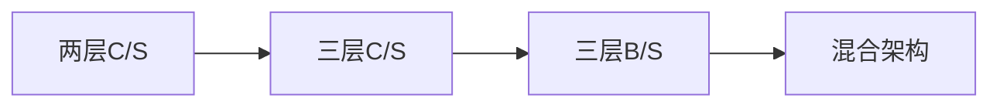

# 软件架构⭐⭐⭐⭐⭐⭐⭐⭐

## 概念

#### 架构的本质

1. 架构为软件系统提供了一个**结构、行为和属性的高级抽象**
2. 软件架构风格是特定应用领域的**惯用模式**，架构定义**一个词汇表和一组约束**

#### 架构的作用

1. 项目干系人进行交流的手段
2. 软件架构是**可传递和可复用的模型**
3. 软件架构是推理和控制的更改更加简单，**有助于循序渐进的原型设计**

架构在**需求分析之后，软件设计之前**，架构设计就是需求分配，即将**满足需求的职责分配到组件上**

所以软件架构的作用主要偏向于非功能性能方面，并不是用于解决具体问题的圭臬。

### 架构的“4+1”视图

和UML“4+1”视图类似

- 逻辑视图： 功能需求（类与对象）
- 开发视图：软件管理
- 进程视图（过程视图）：性能、吞吐量
- 物理视图（ 部署视图 ）：系统拓朴、安装

## 软件架构风格⭐⭐⭐⭐

| 五大架构风格  |                子风格                |
| :-----------: | :----------------------------------: |
|  数据流风格   |         批处理、管道-过滤器          |
| 调用/返回风格 |  主程序/子程序、面向对象、层次结构   |
| 独立构件风格  | 进程通信、事件驱动系统（ 隐式调用 ） |
|  虚拟机风格   |           解释器、规则系统           |
|   仓库风格    |   数据库系统、黑板系统、超文本系统   |

### 数据流风格

数据在流水线的各个节点上被加工。每完成一个环节，数据流都会被送入下一个环节，最终输出处理后的完整结果。

在实际开发中，比如webpack的loader就是典型的数据流风格

优点：

- 松耦合
- 良好的重用性/可维护性
- 可扩展性【标准接口适配】
- 良好的隐蔽性
- 支持并行

缺点：

- 交互性较差
- 复杂性较高
- 性能较差（每个过滤器都需要解析与合成数据）

两个子风格：

| 风格        | 内容关键                       |
| ----------- | ------------------------------ |
| 批处理序列  | 大量**整体**数据，无需用户交互 |
| 管道-过滤器 | **流式数据**、弱用户交互       |

### 调用/返回风格

最常见的风格，现代代码中已经离不开这种架构，比如：简单的函数调用等

包含**分层架构风格**子风格

分层架构：MVC、MVP、三层架构等

### 独立构件风格

**构件之间不直接交互**，达成松耦合

例如： 事件驱动系统

### 虚拟机风格

Java虚拟机，Java跨平台优点。

两个子风格：

- 解释器：适合需要自定义规则的场合
- 规则为中心：在解释器的基础上增加经验规则， 适用于专家系统

### 仓库风格（以数据为中心）

两个子风格和其应用场景

- 数据库系统：数据库
- 黑板系统： **语音识别**、模式识别、图像处理、知识推理

### 闭环控制风格（过程控制）

1. 适合于嵌入式系统，用于解决简单闭环控制问题
2. 经典应用：空调温控，定速巡航。

### C2风格

C2架构风格是一种常见的层次体系架构风格。

该架构风格概括而言，是由连接件绑定的按一定规则运行的并行构件网络，在该架构风格中，各构件之间不能直接连接，只能通过连接件的异步通信机制进行交互，使得构件的替换或更新不影响架构，这种方式体现了高内聚，松耦合的设计思想。

有以下特点：

- **构件之间不能直接连接**
- **构件，连接件都有顶部与底部**
- **构件顶部或底部只能与连接件底部或顶部相连**
- **连接件相互之间可通过顶部及底部连接**( 由其中的一个底部连接另一个的顶部 )
- 构件不感知下一层构件
- 构件可以感知上一层构件
- 构件之间通过连接件的异步消息机制交互

### 层次架构风格

两层C/S: 表示层、数据层

- 开发成本较高
- **客户端程序设计复杂**
- 信息内容和形式单一
- 用户界面风格不一
- **软件移植困难**
- **软件维护和升级困难**
- 新技术不能轻易应用

三层C/S: 表示层、数据层、功能层（业务层）

三层B/S架构：

- 表现层 MVC、MVP、MVVM
- 中间层
- 数据访问层 ORM
- 数据架构层

具体三种表现层架构的了解： **MVC、MVP、MVVM**

### RIA架构风格

RIA: 富互联网应用

RIA是一种特殊的Web应用程序，其用户界面比第一代和第二代Web应用程序具有更丰富的功能。

**它们看起来和感觉更像桌面应用程序。**

主要特点：数据可以缓存在客户端，可以实现比基于HTML的响应速度更快且数据往返于服务器次数更少的用户界面。

### 基于服务的架构SOA

典型应用场景：历史遗留系统

- 服务构件粗粒度，传统构件细粒度居多
- 服务构件的接口是标准的，主要是WSDL接口，传统构件常以具体API形式出现
- 服务构件的实现与语言无关，传统构件绑定某种语言
- 服务构件可以通过构件容器提供QoS服务，传统构件完全由程序代码控制

SOA的实现方式-web service

服务请求者、服务提供者、服务注册中心

关键技术

- 发现服务 UDDI, DISCO
- 描述服务：WSDL， XML Schema
- 消息格式层： SOAP，REST
- 编码格式层： XML（DOM,SAX）
- 传输协议层：HTTP、TCP/IP、SMTP等

SOA的实现方式-ESB 企业服务总线

- 提供位置透明性的消息路由和寻址服务
- 提供服务注册和命名的管理功能
- 支持多种消息传递泛型
- 支持多种广泛使用的传输谢意
- 支持多种数据格式及其相互转换

### 微服务架构

特点：

- 小、且专注一件事情
- 轻量级的通信机制
- 松耦合、独立部署

优势：

- 技术异构性
- 弹性
- 扩展
- 简化部署
- 与组织结构相匹配
- 可组合性
- 对可替代性的优化

### 微服务与SOA

| 微服务                   | SOA                          |
| ------------------------ | ---------------------------- |
| 能拆分就拆分             | 整体的，能放一起就放一起     |
| 纵向业务划分             | 水平分层                     |
| 单一组织负责             | 按层级划分不同部分的组织负责 |
| 细粒度                   | 粗粒度                       |
| 业务逻辑存在每一个服务中 | 业务逻辑横跨多个业务领域     |
| 轻量级通信方式           | ESB总线                      |

#### MDA模型驱动架构

三种核心模型

- 平台独立模型
- 平台相关模型
- code

### ADL架构描述语言

形式化语言，三个基本元素

- 构件：计算或数据存储单元
- 连接件：用于构件之间交互建模的体系结构构造块及其支配这些交互的规则
- 架构配置：构件与连接件的连接图

### 特定领域软件架构DSSA

领域分析、领域设计、领域实现

垂直域：相同领域、深入

水平域：不同领域、平移

**角色**

- 领域专家
- 领域分析人员
- 领域设计人员
- 领域实现人员

**基本活动：**

- 领域分析
- 领域设计
- 领域实现

## 软件架构评估

### 质量属性

- **性能**
- 可靠性
  - 容错
  - 健壮性
- **可用性**
- **安全性**
- **可修改性**
  - 可维护性
  - 可扩展性
  - 结构重组
  - 可移植性
- 功能性
- 可变性
- 互操作性

### 质量属性/性能

性能战术

- 资源需求：
- 资源管理
- 资源仲裁
  - 资源调度策略

### 质量属性/可用性

系统能**正常运行的时间比例**

战术：

- 错误检测：**命令/响应[ping/echo], 心跳，异常**
- 错误恢复: **表决，冗余【主动/被动】，备件**
- 错误预防：进程监视器，事务，从服务器删除

### 质量属性/安全性

机密性、完整性、不可否认性、可控性

- 抵抗攻击: 用户授权、身份验证
- 检测攻击：入侵检测
- 从攻击中恢复: 审计追踪

### 质量属性/可修改性

可修改性战术

- 局部化修改: 泛化模块， 维持语义一致性
- 防止连锁反应：**隐藏信息**
- 推迟绑定时间：运行时注册

### 质量属性/易用性

界面友好、学习系统时间不超过2小时

### 质量属性/可测试性

### 几组概念

- 敏感点：一个或多个构件（或构件之间的关系）的特性
- 权衡点：是影响**多个质量属性**的特性，是多个质量属性的**敏感点**
- **风险点**：架构设计中潜在的、存在问题的架构决策所带来的隐患
- 非风险点：指不会带来隐患，一般以xxxx要求是可以实现的（或接受）的方式表达

### 架构评估方法

- 基于问卷的方式
- 基于度量的方式
- **基于场景的方式**